# 3. System Scope and Context

## 3.1 Business Context

The Universal Knowledge Agent operates as a bridge between external knowledge sources and multiple knowledge management platforms, enabling seamless content discovery, summarization, and integration across different user workflows.

### 3.1.1 Business Context Diagram

```mermaid
graph LR
    EXT["🌐 External Knowledge Sources"]
    UKA["🎯 Universal Knowledge Agent"]
    PLATFORMS["📱 Knowledge Management Platforms"]
    USERS["👥 End Users"]

    EXT --> UKA
    UKA --> PLATFORMS
    PLATFORMS --> USERS
```

### 3.1.2 External Knowledge Sources

| Source Type | Examples | Content Types | Access Method |
|-------------|----------|---------------|---------------|
| 📚 **Documentation** | Official Docs, API References, Dev Guides | Technical specifications, tutorials | Web scraping, APIs |
| 🎥 **YouTube Videos** | Tech Conferences, Tutorials, Expert Talks | Educational content, demonstrations | YouTube Data API |
| 📝 **Academic Papers** | arXiv, Research Papers, IEEE Papers | Research findings, methodologies | Academic APIs, RSS |
| 💬 **Reddit** | r/programming, r/MachineLearning, Tech Subreddits | Discussions, community insights | Reddit API |
| 🔧 **StackOverflow** | Q&A Solutions, Code Snippets, Best Practices | Problem-solving, code examples | StackOverflow API |
| 📁 **GitHub Repos** | Code Examples, Documentation, Issue Discussions | Source code, project docs | GitHub API |
| 📰 **Tech Blogs** | Netflix Tech, Uber Engineering, Company Blogs | Industry insights, case studies | Web scraping, RSS |
| 🤖 **AI Services** | LLM APIs, Summarization, Analysis | Content processing, insights | Direct API integration |

### 3.1.3 Universal Knowledge Agent Components

| Component | Purpose | Key Functions | Outputs |
|-----------|---------|---------------|---------|
| **Content Discovery Engine** | Find relevant content | Search, filter, rank sources | Prioritized content list |
| **AI Processing & Summary Engine** | Extract key insights | Summarize, analyze, extract themes | Structured summaries |
| **Knowledge Integration Engine** | Connect to existing knowledge | Link discovery, relationship mapping | Connected knowledge graphs |
| **Platform Adapters** | Format for target platforms | Transform, format, optimize | Platform-specific content |

### 3.1.4 Knowledge Management Platforms

| Platform | Architecture | Key Features | Content Format |
|----------|-------------|--------------|----------------|
| 📦 **Logseq** | Block-based, Local files, Graph view | Bi-directional linking, local-first | Markdown blocks |
| 📝 **Obsidian** | Markdown files, Vault structure, Plugin ecosystem | Powerful linking, extensible | Markdown files |
| 🗂️ **Notion** | Database entries, Collaborative, Cloud-based | Rich formatting, team features | Database entries |
| 🕸️ **Roam Research** | Graph database, Bidirectional, Daily notes | Research-focused, networked thought | Block references |

### 3.1.5 End Users

| User Type | Primary Goals | Use Cases | Preferred Features |
|-----------|---------------|-----------|-------------------|
| 👨‍💻 **Developers** | Learning new tech, Problem solving, Best practices | Technology research, debugging help | Code examples, tutorials |
| 👩‍🔬 **Researchers** | Literature review, Data gathering, Analysis | Academic research, trend analysis | Paper summaries, citations |
| ✍️ **Technical Writers** | Content creation, Documentation, Research | Article research, fact-checking | Source materials, expert insights |
| 🎓 **Students** | Study materials, Knowledge base, Learning paths | Course support, exam prep | Structured learning materials |

### 3.1.6 Business Partners and Stakeholders

| Partner/Stakeholder | Relationship | Expectations | Interface |
|---------------------|--------------|--------------|-----------|
| **Platform Maintainers** | Integration Partners | Stable, compliant plugins | Plugin APIs, Extension stores |
| **Content Providers** | Data Sources | Respectful API usage | REST APIs, Web scraping |
| **AI Service Providers** | Technology Partners | Cost-effective processing | API integrations |
| **Open Source Community** | Contributors | Quality, maintainable code | GitHub, Documentation |
| **End Users** | Customers | Reliable, valuable insights | User interfaces |
| **Enterprise Users** | Potential customers | Scalable, secure solutions | Enterprise APIs |

## 3.2 Technical Context

### 3.2.1 Technical Context Diagram

### 3.2.1 Technical Context Overview

```mermaid
graph LR
    EXT["🌐 External Knowledge Sources"]

    subgraph UKA["🎯 Knowledge Agent"]
        DISCOVERY["📡 Content Discovery Service"]
        PROCESSING["🔄 AI Processing Pipeline"]
        INTEGRATION["🔗 Knowledge Integration Engine"]
        CACHE["💾 Cache Manager"]
        ADAPTERS["🔌 Platform Adapters"]
    end

    PLATFORMS["📱 Knowledge Management Platforms"]
    USERS["� End Users"]

    EXT --> UKA
    UKA --> PLATFORMS
    PLATFORMS --> USERS
```

### 3.2.2 External APIs and Services

#### Content Discovery APIs

| Service | Protocol | API Version | Rate Limits | Authentication | Data Format |
|---------|----------|-------------|-------------|---------------|-------------|
| 🎥 **YouTube Data API** | REST/HTTPS | v3 | 10,000 units/day | API Key | JSON |
| 💬 **Reddit API** | REST/HTTPS | v1 | 60 req/min | OAuth2/API Key | JSON |
| 📁 **GitHub API** | GraphQL/REST | v4/v3 | 5,000 req/hour | Personal Token | JSON |
| 🔧 **StackOverflow API** | REST/HTTPS | v2.3 | 300 req/day (unauth) | API Key (optional) | JSON |

#### AI/LLM Services

| Service | Protocol | Rate Limits | Cost Model | Capabilities |
|---------|----------|-------------|------------|-------------|
| 🤖 **OpenAI GPT** | REST/HTTPS | Model-dependent | Token-based | Text generation, summarization |
| 🧠 **Anthropic Claude** | REST/HTTPS | Model-dependent | Token-based | Analysis, processing |
| 💻 **Local LLMs (Ollama)** | HTTP/Local | Hardware-limited | Free | Privacy-focused processing |

#### Other APIs

| Service | Protocol | Authentication | Purpose | Data Sources |
|---------|----------|---------------|---------|--------------|
| 📝 **Academic APIs** | REST/XML | None/API Key | Research papers | arXiv, IEEE Xplore, PubMed |
| 🔍 **Search APIs** | REST/HTTPS | API Key | Web search | DuckDuckGo, Brave Search |
| 🌐 **Web Scraping** | HTTP/HTTPS | None | Documentation | Tech blogs, documentation sites |

### 3.2.3 Universal Knowledge Agent Components

| Component | Technology | Purpose | Input | Output |
|-----------|------------|---------|-------|--------|
| 📡 **Content Discovery Service** | Node.js/TypeScript | Find and rank relevant content | Search queries, filters | Prioritized content URLs |
| 🔄 **AI Processing Pipeline** | Python/Node.js | Extract insights and summaries | Raw content | Structured summaries |
| 🔗 **Knowledge Integration Engine** | TypeScript | Link to existing knowledge | Summaries + user content | Connected knowledge graphs |
| 💾 **Cache Manager** | Redis/IndexedDB | Performance optimization | API responses | Cached data |
| 🔌 **Platform Adapters** | TypeScript/JavaScript | Transform content for target platforms | Structured summaries | Platform-specific content |

#### Platform Adapter Details

| Adapter | Target Platform | Technology | Key Functions |
|---------|----------------|------------|---------------|
| 📦 **Logseq Adapter** | Logseq | JavaScript/React | Block formatting, graph integration |
| 📝 **Obsidian Adapter** | Obsidian | TypeScript | Markdown formatting, vault integration |
| 🗂️ **Notion Adapter** | Notion | JavaScript | Database entry creation, rich formatting |
| 🕸️ **Roam Adapter** | Roam Research | JavaScript | Block reference creation, graph updates |

### 3.2.4 Target Platform Environments

#### Native Plugins

| Platform | Runtime Environment | APIs Available | Storage Options | UI Framework |
|----------|-------------------|----------------|-----------------|--------------|
| 📦 **Logseq** | Browser + Node.js | Plugin API, File System API | Local files, IndexedDB | React components |
| 📝 **Obsidian** | Electron renderer | Plugin API, Vault API | Vault files, plugin data | Obsidian UI components |

#### Browser Extensions

| Platform | Extension Type | Manifest Version | Storage APIs | UI Integration |
|----------|----------------|------------------|--------------|----------------|
| 🗂️ **Notion** | Browser Extension | Manifest V3 | Extension storage, IndexedDB | Injected components |
| 🕸️ **Roam Research** | Content Scripts | Manifest V3 | Local storage, extension storage | DOM manipulation |

#### Standalone Options

| Option | Technology | Platform Support | Integration Method | Distribution |
|--------|------------|------------------|-------------------|--------------|
| 💻 **Desktop App** | Electron/Tauri | Cross-platform | File system access | Direct download |
| 🌐 **Web Application** | Progressive Web App | Browser-based | Export/import | Web hosting |

### 3.2.5 Technology Stack by Platform

#### Logseq Integration

| Aspect | Details |
|--------|---------|
| **Runtime** | Browser environment with Node.js module support |
| **APIs** | Logseq Plugin API, File System API (limited) |
| **Storage** | Local file system, IndexedDB for cache |
| **UI** | React components within Logseq's framework |
| **Distribution** | Logseq marketplace, manual installation |

#### Obsidian Integration

| Aspect | Details |
|--------|---------|
| **Runtime** | Electron renderer process |
| **APIs** | Obsidian Plugin API, Vault API |
| **Storage** | Vault files, plugin data folder |
| **UI** | Obsidian's UI components and styling |
| **Distribution** | Obsidian Community Plugins |

#### Notion Integration

| Aspect | Details |
|--------|---------|
| **Runtime** | Browser extension environment |
| **APIs** | Notion API, Browser Extension APIs |
| **Storage** | Extension storage, IndexedDB |
| **UI** | Injected components, popup interfaces |
| **Distribution** | Chrome Web Store, Firefox Add-ons |

#### Roam Research Integration

| Aspect | Details |
|--------|---------|
| **Runtime** | Browser extension, content scripts |
| **APIs** | Roam's unofficial API, DOM manipulation |
| **Storage** | Browser local storage, extension storage |
| **UI** | Injected UI elements, custom components |
| **Distribution** | Browser extension stores |

## 3.3 System Boundaries

### 3.3.1 What's Inside the System

**Knowledge Agent Components:**

- Content discovery and aggregation engine
- AI-powered summarization and analysis
- Knowledge integration and linking logic
- Platform-specific adapters and formatters
- Caching and performance optimization
- User preference and configuration management

**Platform Integrations:**

- Native plugins for Logseq and Obsidian
- Browser extensions for Notion and Roam Research
- Standalone application with export capabilities
- API service for custom integrations

### 3.3.2 What's Outside the System

**External Dependencies:**

- Knowledge management platforms (Logseq, Obsidian, etc.)
- Content source APIs and websites
- AI/LLM processing services
- Internet connectivity and external services
- User's existing knowledge bases and content

**Not Included:**

- Knowledge management platform development
- Content hosting or creation
- AI model training or development
- User authentication systems (beyond API keys)
- Real-time collaboration features
- Content backup or synchronization between platforms

### 3.3.3 Data Flow Boundaries

#### Input Boundaries

- **User Queries**: Search terms, topics, research requests
- **User Preferences**: Platform choice, performance settings, content filters
- **Existing Content**: User's current knowledge base for link discovery
- **External Content**: Web pages, videos, papers, discussions

#### Output Boundaries

- **Formatted Summaries**: Platform-specific content blocks/pages
- **Knowledge Links**: Connections to existing user content
- **Source Attribution**: Proper citations and links
- **Metadata**: Tags, categories, relevance scores

#### Processing Boundaries

- **Client-Side**: Content formatting, UI interactions, caching
- **External APIs**: Content discovery, AI processing
- **Platform APIs**: Content creation, file system access
- **User Control**: All processing requires explicit user initiation

## 3.4 Quality Attributes in Context

### 3.4.1 Performance Context

- **User Tolerance**: 3-second maximum for initial results across all platforms
- **Network Dependencies**: Graceful degradation when external services are slow
- **Platform Constraints**: Respect each platform's performance characteristics
- **Resource Sharing**: Efficient use of shared system resources

### 3.4.2 Security Context

- **Data Privacy**: Minimize exposure of user's private knowledge base
- **API Security**: Secure handling of user API credentials
- **Content Filtering**: Avoid sending sensitive queries to external services
- **Platform Security**: Comply with each platform's security requirements

### 3.4.3 Compatibility Context

- **Platform Versions**: Support current + 2 previous major versions
- **Browser Compatibility**: Chrome, Firefox, Safari support for extensions
- **Operating Systems**: Cross-platform compatibility where platforms support it
- **Feature Parity**: Consistent knowledge agent functionality across all platforms
