# 5. Building Block View

This section describes the static decomposition of the Universal Knowledge Agent system into building blocks and their relationships, following the architectural decisions outlined in the solution strategy.

## 5.1 Whitebox Overall System

### 5.1.1 System Overview

```mermaid
graph TB
    subgraph "Universal Knowledge Agent System"
        CORE["🎯 Core Knowledge Agent"]
        DISCOVERY["📡 Content Discovery Layer"]
        PROCESSING["🔄 AI Processing Pipeline"]
        INTEGRATION["🔗 Knowledge Integration Engine"]
        ADAPTERS["🔌 Platform Adaptation Layer"]
        CACHE["💾 Cache Management Layer"]
        EVENTS["📢 Event Bus"]
    end

    EXT["🌐 External Sources"] --> DISCOVERY
    DISCOVERY --> PROCESSING
    PROCESSING --> INTEGRATION
    INTEGRATION --> ADAPTERS
    ADAPTERS --> PLATFORMS["📱 Platforms"]

    CACHE -.-> DISCOVERY
    CACHE -.-> PROCESSING
    CACHE -.-> INTEGRATION

    EVENTS -.-> CORE
    EVENTS -.-> DISCOVERY
    EVENTS -.-> PROCESSING
    EVENTS -.-> INTEGRATION
```

### 5.1.2 Contained Building Blocks

| Building Block                   | Responsibility                                              | Key Interfaces                             |
| -------------------------------- | ----------------------------------------------------------- | ------------------------------------------ |
| **Core Knowledge Agent**         | Orchestrates overall workflow, coordinates building blocks  | `IKnowledgeAgent`, `IWorkflowOrchestrator` |
| **Content Discovery Layer**      | Finds and filters relevant content from external sources    | `IContentDiscovery`, `ISourceConnector`    |
| **AI Processing Pipeline**       | Processes, summarizes, and extracts insights from content   | `IAIStrategy`, `IContentProcessor`         |
| **Knowledge Integration Engine** | Connects new content with existing knowledge structures     | `IKnowledgeIntegrator`, `ILinkingEngine`   |
| **Platform Adaptation Layer**    | Formats content for specific knowledge management platforms | `IPlatformAdapter`, `IContentFormatter`    |
| **Cache Management Layer**       | Manages multi-level caching for performance optimization    | `ICacheManager`, `ICacheStrategy`          |
| **Event Bus**                    | Enables loose coupling through event-driven communication   | `IEventBus`, `IEventHandler`               |

### 5.1.3 Important Interfaces

| Interface             | Purpose                      | Abstracts                                 | Responsibilities                                                                               |
| --------------------- | ---------------------------- | ----------------------------------------- | ---------------------------------------------------------------------------------------------- |
| **IKnowledgeAgent**   | Main orchestration interface | Overall system workflow                   | Coordinates query processing, manages system configuration, provides capability discovery      |
| **IContentDiscovery** | Content discovery contract   | External content source access            | Abstracts different content sources, handles search ranking, manages source validation         |
| **IAIStrategy**       | AI processing abstraction    | Different AI processing approaches        | Enables switching between local/cloud AI, handles content summarization and insight extraction |
| **IPlatformAdapter**  | Platform-specific formatting | Knowledge management platform differences | Converts content to platform-native formats, handles platform-specific delivery                |
| **ICacheManager**     | Caching abstraction          | Different caching strategies and storage  | Provides unified caching interface, manages cache policies and performance tracking            |
| **IEventBus**         | Event communication          | Inter-component messaging                 | Enables loose coupling, handles event routing and subscription management                      |

## 5.2 Level 2 - Core Knowledge Agent

### 5.2.1 Core Knowledge Agent Whitebox

```mermaid
graph TB
    subgraph "Core Knowledge Agent"
        ORCHESTRATOR["🎼 Workflow Orchestrator"]
        QUERY_PARSER["📝 Query Parser"]
        CONTEXT_MANAGER["🧠 Context Manager"]
        RESPONSE_BUILDER["🏗️ Response Builder"]
        CONFIG_MANAGER["⚙️ Configuration Manager"]
    end

    INPUT["User Query"] --> QUERY_PARSER
    QUERY_PARSER --> ORCHESTRATOR
    ORCHESTRATOR --> CONTEXT_MANAGER
    CONTEXT_MANAGER --> RESPONSE_BUILDER
    RESPONSE_BUILDER --> OUTPUT["Knowledge Response"]

    CONFIG_MANAGER -.-> ORCHESTRATOR
    CONFIG_MANAGER -.-> CONTEXT_MANAGER
```

#### Core Agent Building Blocks

| Component                 | Responsibility                                        | Abstraction Level                                    | Neighbors (Dependencies)                        | Neighbors (Dependents)                       |
| ------------------------- | ----------------------------------------------------- | ---------------------------------------------------- | ----------------------------------------------- | -------------------------------------------- |
| **Workflow Orchestrator** | Coordinates the overall knowledge processing workflow | High-level workflow coordination and step management | Query Parser, Context Manager, Response Builder | External API clients                         |
| **Query Parser**          | Analyzes and structures incoming user queries         | Natural language processing and intent extraction    | Configuration Manager                           | Workflow Orchestrator, Content Discovery     |
| **Context Manager**       | Maintains user context and session state              | Session management and context building              | Cache Management, Configuration Manager         | Workflow Orchestrator, Knowledge Integration |
| **Response Builder**      | Assembles final responses with metadata               | Response assembly and metadata enrichment            | Context Manager, Platform Adapters              | Workflow Orchestrator                        |
| **Configuration Manager** | Manages user preferences and system settings          | Configuration loading, validation, and management    | Event Bus                                       | All other components                         |

## 5.3 Level 2 - Content Discovery Layer

### 5.3.1 Content Discovery Whitebox

```mermaid
graph TB
    subgraph "Content Discovery Layer"
        SEARCH_ENGINE["🔍 Search Engine"]
        SOURCE_CONNECTORS["🔌 Source Connectors"]
        CONTENT_FILTER["🎯 Content Filter"]
        RANKING_ENGINE["📊 Ranking Engine"]
        DISCOVERY_CACHE["💾 Discovery Cache"]
    end

    QUERY["Discovery Query"] --> SEARCH_ENGINE
    SEARCH_ENGINE --> SOURCE_CONNECTORS
    SOURCE_CONNECTORS --> CONTENT_FILTER
    CONTENT_FILTER --> RANKING_ENGINE
    RANKING_ENGINE --> RESULTS["Ranked Content Sources"]

    DISCOVERY_CACHE -.-> SEARCH_ENGINE
    DISCOVERY_CACHE -.-> RANKING_ENGINE
```

#### Discovery Layer Building Blocks

| Component             | Responsibility                                     | Abstraction Level                                          | Neighbors (Dependencies)                          | Neighbors (Dependents)         |
| --------------------- | -------------------------------------------------- | ---------------------------------------------------------- | ------------------------------------------------- | ------------------------------ |
| **Search Engine**     | Coordinates search across multiple content sources | Multi-source search orchestration and result consolidation | Source Connectors, Discovery Cache                | Content Filter, Ranking Engine |
| **Source Connectors** | Interface with external APIs and content sources   | External API abstraction and protocol handling             | External APIs, Rate Limiters                      | Search Engine                  |
| **Content Filter**    | Applies relevance and quality filters              | Content quality assessment and filtering logic             | Search Engine, Configuration Manager              | Ranking Engine                 |
| **Ranking Engine**    | Scores and ranks discovered content                | Content scoring algorithms and preference application      | Content Filter, Discovery Cache, User Preferences | AI Processing Pipeline         |
| **Discovery Cache**   | Caches search results and source metadata          | Search result caching and metadata persistence             | Cache Management Layer                            | Search Engine, Ranking Engine  |

### 5.3.2 Source Connectors Detail

```mermaid
graph LR
    subgraph "Source Connectors"
        YOUTUBE["📺 YouTube Connector"]
        REDDIT["💬 Reddit Connector"]
        GITHUB["🐙 GitHub Connector"]
        DOCS["📚 Documentation Connector"]
        PAPERS["📄 Academic Papers Connector"]
        BLOGS["📰 Blog Connector"]
    end

    API_MANAGER["🔑 API Manager"] --> YOUTUBE
    API_MANAGER --> REDDIT
    API_MANAGER --> GITHUB
    API_MANAGER --> DOCS
    API_MANAGER --> PAPERS
    API_MANAGER --> BLOGS
```

## 5.4 Level 2 - AI Processing Pipeline

### 5.4.1 AI Processing Pipeline Whitebox

```mermaid
graph TB
    subgraph "AI Processing Pipeline"
        CONTENT_PREPROCESSOR["⚡ Content Preprocessor"]
        SUMMARIZATION_ENGINE["📄 Summarization Engine"]
        INSIGHT_EXTRACTOR["💡 Insight Extractor"]
        THEME_ANALYZER["🎨 Theme Analyzer"]
        AI_STRATEGY_SELECTOR["🤖 AI Strategy Selector"]
    end

    RAW_CONTENT["Raw Content"] --> CONTENT_PREPROCESSOR
    CONTENT_PREPROCESSOR --> AI_STRATEGY_SELECTOR
    AI_STRATEGY_SELECTOR --> SUMMARIZATION_ENGINE
    AI_STRATEGY_SELECTOR --> INSIGHT_EXTRACTOR
    AI_STRATEGY_SELECTOR --> THEME_ANALYZER

    SUMMARIZATION_ENGINE --> PROCESSED_CONTENT["Processed Content"]
    INSIGHT_EXTRACTOR --> PROCESSED_CONTENT
    THEME_ANALYZER --> PROCESSED_CONTENT
```

#### AI Processing Building Blocks

| Component                | Responsibility                                     | Abstraction Level                               | Neighbors (Dependencies)                    | Neighbors (Dependents)                                  |
| ------------------------ | -------------------------------------------------- | ----------------------------------------------- | ------------------------------------------- | ------------------------------------------------------- |
| **Content Preprocessor** | Cleans and prepares content for AI processing      | Content normalization and preparation           | Content Discovery Layer                     | AI Strategy Selector                                    |
| **AI Strategy Selector** | Chooses optimal AI strategy based on content type  | Strategy selection and cost optimization        | Content Preprocessor, Configuration Manager | Summarization Engine, Insight Extractor, Theme Analyzer |
| **Summarization Engine** | Creates concise summaries of content               | Content summarization and key point extraction  | AI Strategy Selector, External AI APIs      | Knowledge Integration Engine                            |
| **Insight Extractor**    | Identifies key insights and actionable information | Pattern recognition and insight identification  | AI Strategy Selector, External AI APIs      | Knowledge Integration Engine                            |
| **Theme Analyzer**       | Analyzes content themes and categories             | Content categorization and topic identification | AI Strategy Selector, External AI APIs      | Knowledge Integration Engine                            |

### 5.4.2 AI Strategy Implementations

```mermaid
graph TB
    subgraph "AI Strategies"
        LOCAL_STRATEGY["🏠 Local Processing Strategy"]
        OPENAI_STRATEGY["🤖 OpenAI Strategy"]
        HYBRID_STRATEGY["⚖️ Hybrid Strategy"]
        MOCK_STRATEGY["🎭 Mock Strategy (Testing)"]
    end

    STRATEGY_INTERFACE["IAIStrategy"] --> LOCAL_STRATEGY
    STRATEGY_INTERFACE --> OPENAI_STRATEGY
    STRATEGY_INTERFACE --> HYBRID_STRATEGY
    STRATEGY_INTERFACE --> MOCK_STRATEGY
```

## 5.5 Level 2 - Knowledge Integration Engine

### 5.5.1 Knowledge Integration Whitebox

```mermaid
graph TB
    subgraph "Knowledge Integration Engine"
        LINK_DISCOVERER["🔗 Link Discoverer"]
        RELATIONSHIP_MAPPER["🗺️ Relationship Mapper"]
        CONTEXT_ANALYZER["🧠 Context Analyzer"]
        INTEGRATION_FORMATTER["📋 Integration Formatter"]
    end

    PROCESSED_CONTENT["Processed Content"] --> LINK_DISCOVERER
    USER_CONTEXT["User Context"] --> CONTEXT_ANALYZER

    LINK_DISCOVERER --> RELATIONSHIP_MAPPER
    CONTEXT_ANALYZER --> RELATIONSHIP_MAPPER
    RELATIONSHIP_MAPPER --> INTEGRATION_FORMATTER
    INTEGRATION_FORMATTER --> INTEGRATED_KNOWLEDGE["Integrated Knowledge"]
```

#### Knowledge Integration Building Blocks

| Component                 | Responsibility                                      | Abstraction Level                              | Neighbors (Dependencies)                    | Neighbors (Dependents)    |
| ------------------------- | --------------------------------------------------- | ---------------------------------------------- | ------------------------------------------- | ------------------------- |
| **Link Discoverer**       | Finds connections to existing user knowledge        | Link identification and relationship discovery | AI Processing Pipeline, User Knowledge Base | Relationship Mapper       |
| **Relationship Mapper**   | Maps relationships between new and existing content | Relationship modeling and graph construction   | Link Discoverer, Context Analyzer           | Integration Formatter     |
| **Context Analyzer**      | Analyzes user's existing knowledge context          | Context understanding and gap analysis         | Context Manager, User Knowledge Base        | Relationship Mapper       |
| **Integration Formatter** | Formats content with proper linking and structure   | Content structuring and link integration       | Relationship Mapper                         | Platform Adaptation Layer |

## 5.6 Level 2 - Platform Adaptation Layer

### 5.6.1 Platform Adaptation Whitebox

```mermaid
graph TB
    subgraph "Platform Adaptation Layer"
        ADAPTER_FACTORY["🏭 Adapter Factory"]
        FORMAT_CONVERTERS["🔄 Format Converters"]
        VALIDATION_ENGINE["✅ Validation Engine"]
        DELIVERY_MANAGER["📦 Delivery Manager"]
    end

    subgraph "Platform Adapters"
        LOGSEQ_ADAPTER["📦 Logseq Adapter"]
        OBSIDIAN_ADAPTER["📝 Obsidian Adapter"]
        NOTION_ADAPTER["🗂️ Notion Adapter"]
        ROAM_ADAPTER["🕸️ Roam Adapter"]
    end

    INTEGRATED_KNOWLEDGE["Integrated Knowledge"] --> ADAPTER_FACTORY
    ADAPTER_FACTORY --> LOGSEQ_ADAPTER
    ADAPTER_FACTORY --> OBSIDIAN_ADAPTER
    ADAPTER_FACTORY --> NOTION_ADAPTER
    ADAPTER_FACTORY --> ROAM_ADAPTER

    LOGSEQ_ADAPTER --> FORMAT_CONVERTERS
    OBSIDIAN_ADAPTER --> FORMAT_CONVERTERS
    NOTION_ADAPTER --> FORMAT_CONVERTERS
    ROAM_ADAPTER --> FORMAT_CONVERTERS

    FORMAT_CONVERTERS --> VALIDATION_ENGINE
    VALIDATION_ENGINE --> DELIVERY_MANAGER
    DELIVERY_MANAGER --> PLATFORM_OUTPUT["Platform-Specific Output"]
```

#### Platform Adaptation Building Blocks

| Component             | Responsibility                                  | Abstraction Level                                 | Neighbors (Dependencies)            | Neighbors (Dependents)     |
| --------------------- | ----------------------------------------------- | ------------------------------------------------- | ----------------------------------- | -------------------------- |
| **Adapter Factory**   | Creates appropriate platform adapter instances  | Platform abstraction and adapter instantiation    | Configuration Manager               | Platform-Specific Adapters |
| **Format Converters** | Converts content to platform-specific formats   | Content format transformation and adaptation      | Platform-Specific Adapters          | Validation Engine          |
| **Validation Engine** | Validates content against platform requirements | Content validation and constraint checking        | Format Converters, Platform Schemas | Delivery Manager           |
| **Delivery Manager**  | Handles content delivery to target platforms    | Content delivery orchestration and error handling | Validation Engine, Platform APIs    | External Platform APIs     |

### 5.6.2 Platform-Specific Adapters

```mermaid
graph LR
    subgraph "Adapter Implementations"
        LOGSEQ["📦 Logseq Adapter<br/>- Block hierarchy<br/>- Local file system<br/>- Graph structure"]
        OBSIDIAN["📝 Obsidian Adapter<br/>- Markdown files<br/>- Vault structure<br/>- Wiki links"]
        NOTION["🗂️ Notion Adapter<br/>- Database entries<br/>- Rich blocks<br/>- API integration"]
        ROAM["🕸️ Roam Adapter<br/>- Block references<br/>- Daily notes<br/>- Graph database"]
    end

    ADAPTER_INTERFACE["IPlatformAdapter"] --> LOGSEQ
    ADAPTER_INTERFACE --> OBSIDIAN
    ADAPTER_INTERFACE --> NOTION
    ADAPTER_INTERFACE --> ROAM
```

## 5.7 Level 2 - Cache Management Layer

### 5.7.1 Cache Management Whitebox

```mermaid
graph TB
    subgraph "Cache Management Layer"
        CACHE_COORDINATOR["🎯 Cache Coordinator"]
        MEMORY_CACHE["💾 Memory Cache"]
        PERSISTENT_CACHE["🗄️ Persistent Cache"]
        CACHE_POLICIES["📋 Cache Policies"]
        CACHE_ANALYTICS["📊 Cache Analytics"]
    end

    REQUEST["Cache Request"] --> CACHE_COORDINATOR
    CACHE_COORDINATOR --> MEMORY_CACHE
    CACHE_COORDINATOR --> PERSISTENT_CACHE
    CACHE_POLICIES --> CACHE_COORDINATOR
    CACHE_ANALYTICS --> CACHE_COORDINATOR

    MEMORY_CACHE --> RESPONSE["Cache Response"]
    PERSISTENT_CACHE --> RESPONSE
```

#### Cache Management Building Blocks

| Component             | Responsibility                                               | Abstraction Level                                      | Neighbors (Dependencies)                       | Neighbors (Dependents)                 |
| --------------------- | ------------------------------------------------------------ | ------------------------------------------------------ | ---------------------------------------------- | -------------------------------------- |
| **Cache Coordinator** | Orchestrates caching strategy across different levels        | Multi-level cache orchestration and policy enforcement | Memory Cache, Persistent Cache, Cache Policies | All system layers                      |
| **Memory Cache**      | Provides fast in-memory caching for frequently accessed data | In-memory storage with LRU eviction                    | Cache Coordinator                              | Cache Coordinator                      |
| **Persistent Cache**  | Provides durable caching for expensive operations            | Persistent storage with cleanup and expiration         | Cache Coordinator, File System                 | Cache Coordinator                      |
| **Cache Policies**    | Manages TTL, eviction, and cache invalidation policies       | Cache policy management and validation                 | Configuration Manager                          | Cache Coordinator                      |
| **Cache Analytics**   | Tracks cache performance and optimization opportunities      | Performance monitoring and optimization analysis       | Cache Coordinator, Monitoring System           | Cache Coordinator, System Optimization |

## 5.8 Level 2 - Event Bus

### 5.8.1 Event Bus Whitebox

```mermaid
graph TB
    subgraph "Event Bus"
        EVENT_DISPATCHER["📡 Event Dispatcher"]
        EVENT_ROUTER["🚏 Event Router"]
        SUBSCRIPTION_MANAGER["📋 Subscription Manager"]
        EVENT_LOGGER["📝 Event Logger"]
    end

    PUBLISHERS["Event Publishers"] --> EVENT_DISPATCHER
    EVENT_DISPATCHER --> EVENT_ROUTER
    EVENT_ROUTER --> SUBSCRIBERS["Event Subscribers"]

    SUBSCRIPTION_MANAGER -.-> EVENT_ROUTER
    EVENT_LOGGER -.-> EVENT_DISPATCHER
```

#### Event Bus Building Blocks

| Component                | Responsibility                                               | Abstraction Level                              | Neighbors (Dependencies)          | Neighbors (Dependents)                 |
| ------------------------ | ------------------------------------------------------------ | ---------------------------------------------- | --------------------------------- | -------------------------------------- |
| **Event Dispatcher**     | Receives and dispatches events throughout the system         | Event publishing and distribution coordination | Event Router, Event Logger        | All system components (as publisher)   |
| **Event Router**         | Routes events to appropriate subscribers based on event type | Event routing and subscriber filtering         | Subscription Manager              | Event Dispatcher                       |
| **Subscription Manager** | Manages event subscriptions and unsubscriptions              | Subscription lifecycle management              | Event Router                      | All system components (as subscribers) |
| **Event Logger**         | Logs events for debugging and analytics purposes             | Event monitoring and metrics collection        | Logging System, Monitoring System | Event Dispatcher                       |

## 5.9 Cross-Cutting Concerns

Cross-cutting concerns are aspects that span multiple building blocks and affect the system as a whole. These concerns are implemented as separate layers or components that integrate with all other building blocks.

### 5.9.1 Logging and Observability

```mermaid
graph TB
    subgraph "Logging Infrastructure"
        LOG_COORDINATOR["📝 Log Coordinator"]
        LOG_FORMATTERS["📋 Log Formatters"]
        LOG_DESTINATIONS["📤 Log Destinations"]
        LOG_FILTERS["🎯 Log Filters"]
        METRICS_COLLECTOR["📊 Metrics Collector"]
        TRACE_MANAGER["🔍 Trace Manager"]
    end

    ALL_COMPONENTS["All System Components"] --> LOG_COORDINATOR
    LOG_COORDINATOR --> LOG_FILTERS
    LOG_FILTERS --> LOG_FORMATTERS
    LOG_FORMATTERS --> LOG_DESTINATIONS
    LOG_COORDINATOR --> METRICS_COLLECTOR
    LOG_COORDINATOR --> TRACE_MANAGER
```

#### Logging Building Blocks

| Component             | Responsibility                                  | Integration Points                           | Configuration                                  |
| --------------------- | ----------------------------------------------- | -------------------------------------------- | ---------------------------------------------- |
| **Log Coordinator**   | Central logging orchestration                   | All building blocks inject logging interface | Log levels, output formats, destinations       |
| **Log Formatters**    | Format log messages for different outputs       | Log Coordinator, Structured logging          | JSON, plain text, custom formats               |
| **Log Destinations**  | Route logs to appropriate destinations          | Log Formatters, External logging services    | Console, file, remote services, platforms      |
| **Log Filters**       | Filter logs based on level, component, patterns | Log Coordinator, Configuration Manager       | Level filtering, component filtering, sampling |
| **Metrics Collector** | Collect and aggregate system metrics            | All building blocks, Performance monitoring  | Performance counters, business metrics         |
| **Trace Manager**     | Manage distributed tracing across components    | All building blocks, Request correlation     | Request tracing, correlation IDs, spans        |

#### Integration with Building Blocks

| Building Block            | Logging Aspects                                   | Metrics Tracked                           | Trace Points                            |
| ------------------------- | ------------------------------------------------- | ----------------------------------------- | --------------------------------------- |
| **Core Knowledge Agent**  | Workflow start/end, errors, configuration changes | Request processing time, success rate     | Request entry, orchestration steps      |
| **Content Discovery**     | API calls, cache hits/misses, source failures     | Discovery latency, source reliability     | Source queries, ranking operations      |
| **AI Processing**         | API usage, token consumption, processing time     | AI costs, processing efficiency           | Content processing, strategy selection  |
| **Knowledge Integration** | Link discovery, relationship mapping              | Integration success rate, link quality    | Context analysis, relationship building |
| **Platform Adapters**     | Content delivery, format validation, API calls    | Delivery success rate, format errors      | Content formatting, platform delivery   |
| **Cache Management**      | Cache operations, evictions, performance          | Hit rate, memory usage, performance gains | Cache lookups, invalidations            |
| **Event Bus**             | Event publishing, subscription management         | Event throughput, subscription health     | Event flow, message delivery            |

### 5.9.2 Error Handling and Resilience

```mermaid
graph TB
    subgraph "Error Handling Infrastructure"
        ERROR_COORDINATOR["� Error Coordinator"]
        ERROR_CLASSIFIER["📊 Error Classifier"]
        RECOVERY_MANAGER["🔄 Recovery Manager"]
        CIRCUIT_BREAKER["⚡ Circuit Breaker"]
        RETRY_MANAGER["🔁 Retry Manager"]
        FALLBACK_PROVIDER["🛡️ Fallback Provider"]
    end

    ALL_COMPONENTS --> ERROR_COORDINATOR
    ERROR_COORDINATOR --> ERROR_CLASSIFIER
    ERROR_CLASSIFIER --> RECOVERY_MANAGER
    RECOVERY_MANAGER --> CIRCUIT_BREAKER
    RECOVERY_MANAGER --> RETRY_MANAGER
    RECOVERY_MANAGER --> FALLBACK_PROVIDER
```

#### Error Handling Building Blocks

| Component             | Responsibility                                    | Recovery Strategies                           | Integration Points                        |
| --------------------- | ------------------------------------------------- | --------------------------------------------- | ----------------------------------------- |
| **Error Coordinator** | Central error handling orchestration              | Error aggregation, escalation                 | All building blocks                       |
| **Error Classifier**  | Categorize errors by type and severity            | Transient vs permanent, business vs technical | Error Coordinator, Configuration          |
| **Recovery Manager**  | Execute appropriate recovery strategies           | Retry, fallback, graceful degradation         | Error Classifier, all recovery components |
| **Circuit Breaker**   | Prevent cascade failures                          | Open/closed/half-open states                  | External APIs, unreliable components      |
| **Retry Manager**     | Handle transient failures with intelligent retry  | Exponential backoff, jitter, limits           | External APIs, network operations         |
| **Fallback Provider** | Provide alternative functionality during failures | Cached data, simplified responses, mock data  | All external dependencies                 |

#### Error Handling Strategies by Building Block

| Building Block            | Error Types                                          | Recovery Strategies                                  | Fallback Options                           |
| ------------------------- | ---------------------------------------------------- | ---------------------------------------------------- | ------------------------------------------ |
| **Content Discovery**     | API rate limits, network failures, invalid responses | Retry with backoff, circuit breaker, source rotation | Cached results, alternative sources        |
| **AI Processing**         | API quota exceeded, processing failures, timeout     | Fallback to simpler models, retry, request queuing   | Local processing, simplified summaries     |
| **Knowledge Integration** | Link resolution failures, context missing            | Skip failed links, partial integration               | Basic content without links                |
| **Platform Adapters**     | Platform API failures, format errors                 | Retry delivery, format fallback                      | Store for later, simplified format         |
| **Cache Management**      | Storage failures, corruption                         | Fallback to source, cache rebuild                    | Direct source access, degraded performance |

### 5.9.3 Security and Privacy

```mermaid
graph TB
    subgraph "Security Infrastructure"
        SECURITY_COORDINATOR["🔒 Security Coordinator"]
        DATA_SANITIZER["🧹 Data Sanitizer"]
        ENCRYPTION_MANAGER["🔐 Encryption Manager"]
        ACCESS_CONTROLLER["� Access Controller"]
        PRIVACY_FILTER["🛡️ Privacy Filter"]
        AUDIT_LOGGER["📋 Audit Logger"]
    end

    ALL_DATA_FLOWS["All Data Flows"] --> SECURITY_COORDINATOR
    SECURITY_COORDINATOR --> DATA_SANITIZER
    SECURITY_COORDINATOR --> PRIVACY_FILTER
    SECURITY_COORDINATOR --> ENCRYPTION_MANAGER
    SECURITY_COORDINATOR --> ACCESS_CONTROLLER
    SECURITY_COORDINATOR --> AUDIT_LOGGER
```

#### Security Building Blocks

| Component                | Responsibility                                 | Security Scope                               | Applied To                               |
| ------------------------ | ---------------------------------------------- | -------------------------------------------- | ---------------------------------------- |
| **Security Coordinator** | Orchestrate security policies across system    | System-wide security policy enforcement      | All data flows and operations            |
| **Data Sanitizer**       | Remove or mask sensitive information           | PII detection and removal, content filtering | All external API calls, user content     |
| **Encryption Manager**   | Handle encryption/decryption of sensitive data | At-rest and in-transit encryption            | API keys, user data, cache contents      |
| **Access Controller**    | Manage access to system resources              | Authentication, authorization, permissions   | API access, configuration, user data     |
| **Privacy Filter**       | Ensure privacy compliance                      | GDPR compliance, data minimization           | User data processing, external sharing   |
| **Audit Logger**         | Log security-relevant events                   | Security event tracking, compliance auditing | All security operations, access attempts |

### 5.9.4 Configuration Management

```mermaid
graph TB
    subgraph "Configuration Infrastructure"
        CONFIG_COORDINATOR["⚙️ Configuration Coordinator"]
        CONFIG_LOADER["� Configuration Loader"]
        CONFIG_VALIDATOR["✅ Configuration Validator"]
        CONFIG_MERGER["🔀 Configuration Merger"]
        CONFIG_WATCHER["👁️ Configuration Watcher"]
        DEFAULT_PROVIDER["🎯 Default Provider"]
    end

    CONFIG_SOURCES["Configuration Sources"] --> CONFIG_LOADER
    CONFIG_LOADER --> CONFIG_VALIDATOR
    CONFIG_VALIDATOR --> CONFIG_MERGER
    DEFAULT_PROVIDER --> CONFIG_MERGER
    CONFIG_MERGER --> CONFIG_COORDINATOR
    CONFIG_WATCHER --> CONFIG_COORDINATOR
    CONFIG_COORDINATOR --> ALL_COMPONENTS["All Components"]
```

#### Configuration Building Blocks

| Component                     | Responsibility                            | Configuration Types                      | Scope                             |
| ----------------------------- | ----------------------------------------- | ---------------------------------------- | --------------------------------- |
| **Configuration Coordinator** | Central configuration management          | System, user, platform-specific settings | System-wide                       |
| **Configuration Loader**      | Load configuration from various sources   | Files, environment, remote, user input   | All configuration sources         |
| **Configuration Validator**   | Validate configuration against schemas    | Schema validation, constraint checking   | All configuration data            |
| **Configuration Merger**      | Merge configuration from multiple sources | Priority-based merging, override rules   | Default + user + runtime settings |
| **Configuration Watcher**     | Monitor configuration changes             | File watching, remote polling            | Dynamic configuration updates     |
| **Default Provider**          | Provide sensible defaults                 | Platform defaults, feature defaults      | All configurable components       |

### 5.9.5 Performance Monitoring

```mermaid
graph TB
    subgraph "Performance Monitoring Infrastructure"
        PERF_COORDINATOR["📊 Performance Coordinator"]
        METRICS_AGGREGATOR["� Metrics Aggregator"]
        PERFORMANCE_ANALYZER["� Performance Analyzer"]
        BOTTLENECK_DETECTOR["🎯 Bottleneck Detector"]
        OPTIMIZATION_ADVISOR["� Optimization Advisor"]
    end

    ALL_COMPONENTS --> PERF_COORDINATOR
    PERF_COORDINATOR --> METRICS_AGGREGATOR
    METRICS_AGGREGATOR --> PERFORMANCE_ANALYZER
    PERFORMANCE_ANALYZER --> BOTTLENECK_DETECTOR
    BOTTLENECK_DETECTOR --> OPTIMIZATION_ADVISOR
```

#### Performance Monitoring Building Blocks

| Component                   | Responsibility                                   | Monitored Aspects                               | Output                              |
| --------------------------- | ------------------------------------------------ | ----------------------------------------------- | ----------------------------------- |
| **Performance Coordinator** | Orchestrate performance monitoring across system | System-wide performance tracking                | Performance dashboards, alerts      |
| **Metrics Aggregator**      | Collect and aggregate performance metrics        | Latency, throughput, resource usage             | Aggregated metrics, trends          |
| **Performance Analyzer**    | Analyze performance patterns and trends          | Performance baselines, anomaly detection        | Performance reports, insights       |
| **Bottleneck Detector**     | Identify system bottlenecks and constraints      | Resource contention, slow operations            | Bottleneck reports, recommendations |
| **Optimization Advisor**    | Suggest system optimizations                     | Configuration tuning, architecture improvements | Optimization recommendations        |

### 5.9.6 Cross-Cutting Integration Patterns

#### Dependency Injection Pattern

All building blocks receive cross-cutting concerns through dependency injection:

| Building Block                 | Injected Concerns                    | Integration Method    |
| ------------------------------ | ------------------------------------ | --------------------- |
| **All Components**             | Logger, Configuration, Error Handler | Constructor injection |
| **External Integrations**      | Security Manager, Circuit Breaker    | Wrapper/Proxy pattern |
| **Data Processing Components** | Performance Monitor, Cache Manager   | Decorator pattern     |
| **Event-Driven Components**    | Event Bus, Audit Logger              | Observer pattern      |

#### Aspect-Oriented Programming (AOP) Integration

Cross-cutting concerns are applied as aspects:

| Concern                    | Application Method         | Target Operations                  |
| -------------------------- | -------------------------- | ---------------------------------- |
| **Logging**                | Method interception        | All public methods, external calls |
| **Error Handling**         | Exception handling aspects | All risky operations               |
| **Performance Monitoring** | Timing aspects             | All processing operations          |
| **Security**               | Authorization aspects      | All data access operations         |
| **Caching**                | Caching aspects            | Expensive operations               |

This building block view provides a comprehensive understanding of the system's static structure while maintaining clear separation of concerns and enabling flexibility for implementation and evolution.
